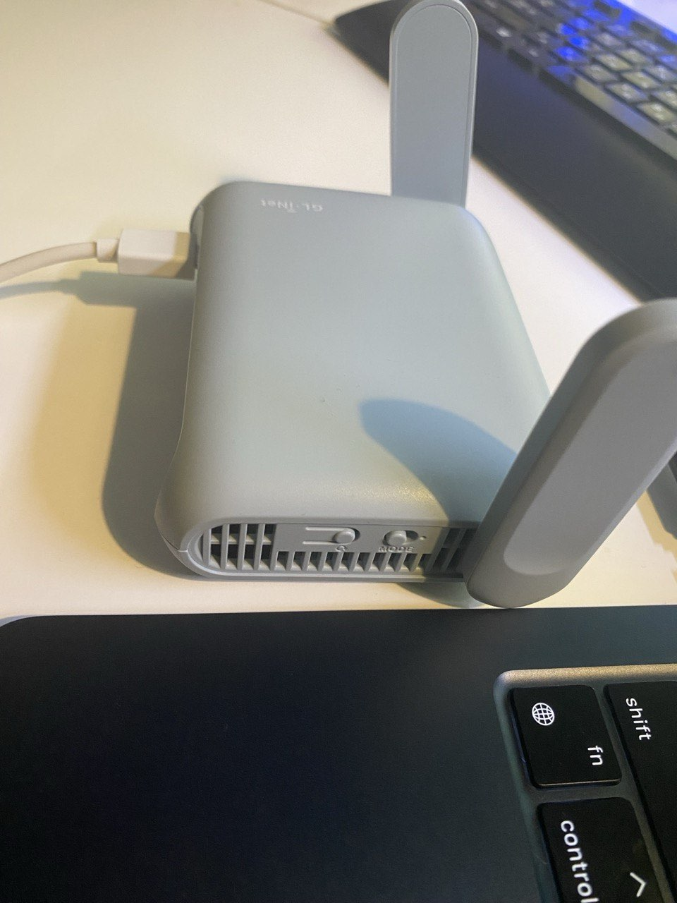

# vpn-xray

Portable OpenWrt bundle for a GL.iNet child router that forwards client TCP traffic to a VPS over `VLESS + Reality`, with no proxy settings on client devices.



This repository targets the compact `GL.iNet GL-MT3000` travel router shown above. It runs from `5V` power, is small enough to throw in a bag, and can be powered from a Mac over USB while you work through your own VPN/VPS path. The physical toggle visible on the front edge is used here as the source of truth for enabling or disabling the proxy path.

The main use case is split routing from a work laptop: keep ordinary traffic outside the personal tunnel, but send the destinations you actually need through your own VPS instead of through a corporate VPN. That is useful when you need stable access to selected external services, including foreign LLM agents, without changing proxy settings on the client. The router UI also supports fast SSH-first provisioning of another clean Debian VPS, so if the current server gets blocked or you lose access to it, you can move to another reachable host and stay online quickly.

All installation-specific values are supplied through local untracked `.env` files created from the examples in `config/`.

## What Works Right Now

- `xray-core 26.3.27` on the router with `VLESS + Reality`
- transparent client TCP forwarding through `redsocks`
- GL hardware switch for `path on / path off`
- SSH-first VPS profile management in the web UI
- quick move to another clean Debian VPS if you still have SSH access to it
- shared GitHub-backed list of domains / IPv4 / CIDR
- `full` and `selective` routing modes on the GL router
- domain-aware selective mode on GL through `dnsmasq -> ipset`
- shared-rules consumer for ASUS `shadowsocks-libev`

## Documentation

- [Documentation Index](./docs/README.md)
- [Setup Runbook](./docs/SETUP-RUNBOOK.md)
- [Current Implementation State](./docs/CURRENT-LAB-STATE.md)
- [Web UI](./docs/WEB-UI.md)
- [Shared Rules](./docs/SHARED-RULES.md)
- [Architecture](./docs/ARCHITECTURE.md)
- [UI Extensibility Notes](./docs/UI-EXTENSIBILITY.md)

## What This Bundle Provides

- deploys `xray-core 26.3.27` to the child router
- deploys `redsocks` and `libevent2-core7`
- installs OpenWrt init scripts for `codex-xray`, `codex-transproxy`, `xray-switch-watchdog`, and `router-rules-sync`
- keeps the GL hardware switch as the source of truth for `path on/off`
- provides a standalone admin page at `https://<router>/xray.html`
- manages VPS profiles on the router through an SSH-first flow
- supports shared destination rules through an operator-owned GitHub repo
- supports two consumers for the shared list:
  - GL selective routing via `dnsmasq -> ipset`
  - ASUS `shadowsocks-libev dst_ips_forward`

## Mandatory Local Files

Create these untracked files before you start:

```bash
cp config/vps.env.example config/vps.env
cp config/router.env.example config/router.env
# optional, only if you also deploy the ASUS consumer
cp config/asus-router.env.example config/asus-router.env
```

For a normal first install, edit only:

- `config/router.env`
  - `ROUTER_HOST`
- `config/vps.env`
  - `VPS_HOST`

Then generate the Xray identity values automatically:

```bash
./scripts/init-config.sh
```

These local `.env` files are ignored by git. Required values are enforced, and the deploy scripts fail fast if placeholders remain.

Validate them explicitly before deploy:

```bash
./scripts/validate-env.sh vps
./scripts/validate-env.sh router
# optional
./scripts/validate-env.sh asus
```

## Quick Start

1. Copy `config/vps.env.example` to `config/vps.env`.
2. Copy `config/router.env.example` to `config/router.env`.
3. Fill only `VPS_HOST` and `ROUTER_HOST`.
4. Generate the Xray values:

```bash
./scripts/init-config.sh
```

5. Deploy the VPS:

```bash
./scripts/deploy-vps-config.sh
```

6. Deploy the GL router:

```bash
./scripts/deploy-child-router.sh
```

7. Verify the GL router:

```bash
./scripts/verify-child-router.sh
```

8. If you also need the ASUS shared-rules consumer:

```bash
./scripts/deploy-asus-rules.sh
```

After deploy, open:

- `https://<router-host>/xray.html`

From there you can:

- inspect or switch VPS profiles
- sync router and VPS config
- manage the shared selective-rules list
- see whether the router is already in sync with GitHub and current runtime state

## Required Parameters

Values you usually replace by hand:

- router management host
- VPS host
- shared-rules GitHub repo URLs if you want Git-backed selective rules immediately

Values that can be generated automatically:

- Xray UUID
- Reality public/private key pair
- Reality short ID
- default SNI / camouflage host

Values already pinned here and normally reused as-is:

- `xray-core 26.3.27`
- GL package URLs and checksums for `redsocks` / `libevent`
- default ports `1083 / 1084 / 12345`
- default sync interval `30s`

## Verification Targets

Prefer these checks:

- `https://www.google.com`
- `https://ifconfig.me/ip`
- `https://ipinfo.io/ip`
- `https://api.openai.com/v1/models`

Do not use `chatgpt.com` as the success criterion. VPS IP reputation can still trigger Cloudflare challenge even when the transport path is healthy.

## Shared Rules Model

The shared rules repo is external to this repo and operator-owned.

Expected shape:

- one GitHub repo chosen by the operator
- canonical file at `lists/shared-targets.txt`
- one non-comment rule per line
- supported rule types:
  - domain
  - IPv4
  - IPv4 CIDR

Behavior:

- `full` mode on GL sends all LAN TCP through the VPS path
- `selective` mode on GL routes:
  - literal IP/CIDR by `ipset`
  - domains dynamically by `dnsmasq -> ipset`
- ASUS consumes a resolved IPv4 snapshot because `shadowsocks-libev` cannot match domains directly

## Operational Constraints

- Do not connect the child router to the same parent network by both `LAN-LAN` and `Wi-Fi repeater` at the same time.
- Domain-based selective routing on GL depends on clients using the router DNS path.
- Already-open TCP sessions do not jump to a new routing decision mid-flight; new rules fully dominate only after the relevant DNS/cache/connection state turns over.
- The rules sync loop runs every `30s` by default and avoids redundant runtime work when GitHub and the applied ruleset already match.

## Reproducibility Notes

- `config/router.env.example`, `config/vps.env.example`, and `config/asus-router.env.example` are the public templates.
- `scripts/validate-env.sh` is the preflight gate.
- `scripts/deploy-vps-config.sh`, `scripts/deploy-child-router.sh`, and `scripts/deploy-asus-rules.sh` are the supported entrypoints.
- `scripts/register-router-rules-deploy-key.sh` bootstraps the router deploy key for the shared-rules GitHub repo.

## File Map

- `config/router.env.example`: child-router template
- `config/vps.env.example`: VPS template
- `config/asus-router.env.example`: ASUS shared-rules template
- `scripts/validate-env.sh`: placeholder / required-field validation
- `scripts/deploy-vps-config.sh`: deploy VPS `xray` config
- `scripts/deploy-child-router.sh`: deploy GL router runtime, web UI, and shared-rules consumer
- `scripts/deploy-asus-rules.sh`: deploy ASUS shared-rules consumer
- `scripts/verify-child-router.sh`: smoke-test the GL proxy path
- `router-files/router-rules`: shared-rules sync / merge / apply tool
- `router-files/xray.html`: standalone admin page
- `router-files/xray-admin.cgi`: runtime / logs / smoke backend
- `router-files/xray-vps.cgi`: VPS-profile / SSH-first backend
- `router-files/xray-rules.cgi`: shared-rules backend
