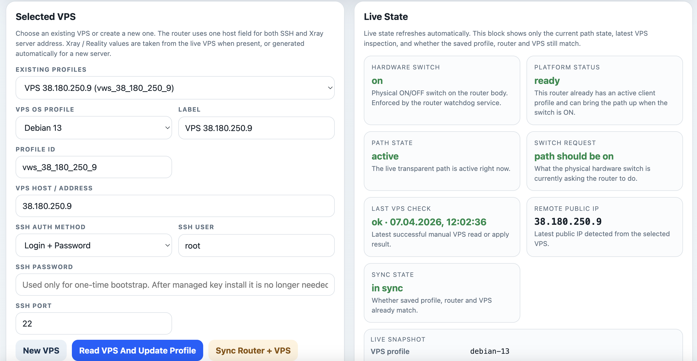
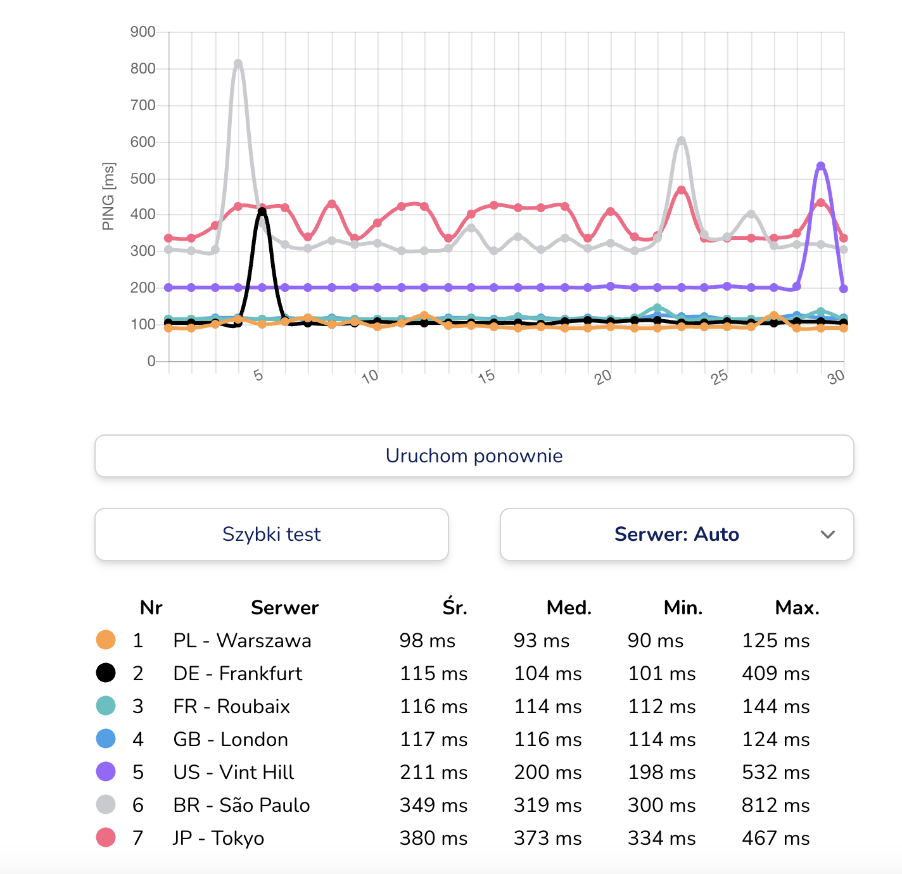

# vpn-xray

`vpn-xray` is a router-first wrapper around [Xray-core](https://github.com/XTLS/Xray-core).

It is meant for one practical job: put a small travel router between your devices and the internet, then move traffic through your own VPS without manually hand-editing Xray configs every time.


The reference device in this repository is the compact `GL.iNet GL-MT3000` travel router shown above. It runs from `5V`, can be powered from a Mac over USB, and is small enough to keep in a bag. The physical switch on the front edge remains the source of truth for `path on / path off`.

The default behavior after setup is simple:

- connect devices to this router
- keep the physical switch in `ON`
- route all client traffic through your VPS in `full` mode

Later, in the router UI, you can keep `full` mode or switch to `selective` mode if you want only chosen destinations through the VPS.

## Supported Hello-World

Current primary supported combination:

- router: `GL.iNet GL-MT3000`
- router profile: [`gl-mt3000-glinet`](./routers/gl-mt3000-glinet/README.md)
- VPS OS: `Debian 13`
- VPS profile: [`debian-13`](./vps/debian-13/README.md)

This stack is currently `IPv4-only` end to end. Your VPS must have a usable global IPv4 address.

## Quick Start: One Command for Router + VPS

If you already have the supported router and one reachable Debian 13 VPS, start with this path first.

Run it from the repository root:

```sh
ROUTER_PASSWORD='ROUTER_ADMIN_PASSWORD' VPS_PASSWORD='VPS_ROOT_PASSWORD' ./bootstrap-router-vps.sh root@192.168.8.1 38.180.250.9
```

If local SSH to the router already works without an extra password prompt, omit `ROUTER_PASSWORD`:

```sh
VPS_PASSWORD='VPS_ROOT_PASSWORD' ./bootstrap-router-vps.sh root@192.168.8.1 38.180.250.9
```

What this one command does:

- opens local SSH to the router
- installs the router platform from the current local checkout
- uploads the bundled router and VPS profiles
- has the router inspect the VPS, install Xray when needed, and sync both sides
- verifies that the router proxy comes up and can reach the internet through the VPS

Before the final verification step, keep the GL.iNet physical switch in `ON`.

Local requirements for this path:

- `bash`
- `ssh`
- `ssh-keygen`
- `tar`
- `python3`
- `curl`

### One-Command Parameters

| Name | Required? | Default | Relationship |
| --- | --- | --- | --- |
| `router-ssh` or `ROUTER_SSH` | optional | `root@192.168.8.1` | Positional `router-ssh` wins over `ROUTER_SSH`. This is only the workstation -> router SSH target. |
| `vps-host` or `VPS_HOST` | yes | none | Positional `vps-host` wins over `VPS_HOST`. This value is written into the router profile as the VPS SSH host and is also the default for `XRAY_SERVER`. |
| `ROUTER_PASSWORD` | optional | unset | Used only by the workstation for router login. It is not the VPS password and is not stored as the router's saved VPS credential. |
| `VPS_PASSWORD` | recommended for first run; required in password mode | unset | Required when `VPS_AUTH_MODE=password`. In `auto`, keep it set even if your workstation already has key-based VPS access, because the script may still need password fallback if the router cannot use the temporary key. |
| `VPS_SSH_USER` / `VPS_SSH_PORT` | optional | `root` / `22` | Used both by the workstation preflight checks and by the router profile that gets applied. |
| `VPS_SSH_HOST` | optional | `VPS_HOST` | Used only by the workstation while seeding temporary SSH access. The router still stores and later uses `VPS_HOST` as its SSH host. |
| `XRAY_SERVER` | optional | `VPS_HOST` | Public Xray endpoint. Override this only when the Reality/Xray server address must differ from the SSH host saved in the router profile. |
| `XRAY_SERVER_NAME` | optional | selected VPS profile default | Reality `serverName`. Set it only when you intentionally want a different value than the profile default. |
| `XRAY_PORT` | optional | `443` | Xray service port. Independent from `VPS_SSH_PORT`. |
| `VPS_AUTH_MODE` | optional | `auto` | `auto` tries workstation key access first and falls back when needed. `password` requires `VPS_PASSWORD`. `private_key` still benefits from `VPS_PASSWORD` as a fallback. |
| `PROFILE_ID` / `PROFILE_LABEL` | optional | derived from `VPS_HOST` / `VPS $VPS_HOST` | Changes only how the profile is named and stored on the router. |
| `ROUTER_PROFILE` / `VPS_PROFILE` | optional advanced | `gl-mt3000-glinet` / `debian-13` | Change these only when testing another supported profile pair. |

Rules that matter:

- `VPS_HOST` is the central value for the router-side profile: it is the SSH host that the router later uses, and it also becomes the default `XRAY_SERVER`.
- `VPS_SSH_HOST` affects only the workstation's bootstrap step. It does not change what the router stores.
- `XRAY_SERVER` affects only the Xray endpoint. It does not change how the router SSHes into the VPS.
- positional `router-ssh` and `vps-host` override the corresponding environment variables when both are set.

For a fuller parameter matrix and more examples, see [`docs/SETUP-RUNBOOK.md`](./docs/SETUP-RUNBOOK.md).

## UI-First Path

Use this path when you do not want the one-command local-checkout flow above.

You do not need WSL, Python, Homebrew, or a local installer for this UI-first path.

You only need:

- the router reachable over SSH at `root@192.168.8.1`
- one Debian 13 VPS reachable over `root` SSH
- any computer with an `ssh` client

If `ssh` is missing on Windows, enable the built-in `OpenSSH Client` feature first and then use the same commands.

### 1. Prepare the Router

1. Factory-reset the router.
2. Connect your computer to the router by Wi-Fi or LAN.
3. Open `http://192.168.8.1`.
4. Finish the GL.iNet first-run wizard and set the admin password.
5. Test SSH:

```sh
ssh root@192.168.8.1
```

Use the same password you set in the GL.iNet web interface.

### 2. Prepare the VPS

Before you touch this repository, make sure this already works:

```sh
ssh root@YOUR_VPS_IP
```

Requirements:

- `Debian 13`
- global IPv4
- `root` SSH access

### 3. Bootstrap the Platform on the Router

The normal path is:

```sh
./bootstrap-router-ssh.sh root@192.168.8.1
```

That helper uses only local `ssh`, keeps its own installer SSH cache, survives router factory resets, and runs the real bootstrap on the router itself. You do not need `ssh-keygen`, `wget`, or `curl` on your computer for the normal path.

What this does:

- installs the router runtime
- installs the web UI
- installs bundled VPS installer profiles on the router
- leaves the path dormant until you configure a VPS in the UI

If this step fails, the router usually tells you what to fix:

- no internet uplink on the router
- wrong system time / NTP not settled yet
- unsupported firmware or missing router features

### 4. Finish in the Router UI

Open:

```text
https://192.168.8.1/xray.html
```

Then:

1. Create or select a VPS profile.
2. Fill `VPS Host / Address`.
3. Choose SSH auth:
   - password
   - private key
   - or reuse the router-managed key later
4. Click `Sync Router + VPS`.

The router will:

- reach the VPS over SSH
- inspect the target system
- install Xray on the VPS if needed
- generate or reuse the required client/server values
- sync the VPS and the router together

Example of the Xray control panel on a `GL.iNet GL-MT3000`:



### 5. Use the Router

After the first successful sync:

1. Connect your laptop, phone or other device to the GL.iNet router.
2. Put the physical switch in the `ON` position.
3. By default, `full` mode sends all client traffic through the VPS.

Good first checks from a device behind the router:

- `https://ifconfig.me/ip`
- `https://ipinfo.io/ip`
- `https://www.google.com`

If the transport is healthy, those IP checks should show the VPS egress IP, not your home provider IP.

`api.openai.com` is only an advisory check. Some VPS IPs are filtered by OpenAI even when the VPN/proxy path itself is fine.

## Why This Exists

The main use case is simple and practical:

- keep a small router in your bag
- power it from USB
- connect your work laptop or phone to it
- use your own VPS as the internet exit

That is useful when:

- you want all traffic through your own VPS
- you need `selective` mode later, so only chosen destinations go through the VPS
- you want to stay productive even if one VPS gets blocked
- you want to switch to another Debian VPS quickly from the router UI itself

If your current VPS is gone, but you still have SSH access to another Debian server, the router can provision that new VPS from the web UI without going back to manual Xray setup.

## Shared Rules and Selective Mode

`full` mode is the default and simplest path.

`selective` mode is optional.

When you switch the router to `selective`:

- literal `IPv4` / `CIDR` rules are matched directly
- domain rules are tracked live on the router through `dnsmasq -> ipset`
- the shared list can be GitHub-backed if you configure that later

See:

- [`docs/SHARED-RULES.md`](./docs/SHARED-RULES.md)
- [`docs/WEB-UI.md`](./docs/WEB-UI.md)

## Advanced Path

This repository still ships a local advanced installer:

- [`install.sh`](./install.sh)
- [`bootstrap-router-vps.sh`](./bootstrap-router-vps.sh)

That path is useful for developers, CI, or people who want one local command to orchestrate both the router and the VPS from their workstation.

For most users, the recommended path is still:

1. bootstrap the platform on the router over SSH
2. configure the VPS from `xray.html`

## Read Next

- Friendly first install:
  - [`docs/GETTING-STARTED.md`](./docs/GETTING-STARTED.md)
- Technical runbook:
  - [`docs/SETUP-RUNBOOK.md`](./docs/SETUP-RUNBOOK.md)
- Web UI behavior:
  - [`docs/WEB-UI.md`](./docs/WEB-UI.md)
- Shared rules:
  - [`docs/SHARED-RULES.md`](./docs/SHARED-RULES.md)
- Architecture:
  - [`docs/ARCHITECTURE.md`](./docs/ARCHITECTURE.md)

## Repository Layout

Every main folder has its own `README.md`.

- [`bootstrap-router.sh`](./bootstrap-router.sh)
  - router-side bootstrap entrypoint that runs on the router itself
- [`bootstrap-router-ssh.sh`](./bootstrap-router-ssh.sh)
  - easiest local helper for the primary path; requires only `ssh` on your computer
- [`install.sh`](./install.sh)
- [`bootstrap-router-vps.sh`](./bootstrap-router-vps.sh)
  - advanced local installer for developers and CI
- [`install.env.example`](./install.env.example)
  - optional input file for the advanced local installer
- [`common/`](./common/README.md)
  - shared bootstrap and validation helpers
- [`routers/`](./routers/README.md)
  - router profiles and shared router-side assets
- [`vps/`](./vps/README.md)
  - VPS profiles and server-side payloads
- [`docs/`](./docs/README.md)
  - user-facing docs, runbooks, UI behavior and architecture

## Ping Result Example

The screenshot below shows a ping test result through the configured path:



In this example, latency is `100ms+`. That is close to the critical edge for reaction-heavy games, but for general browsing, work traffic, calls, and most non-competitive use the connection remains stable.

## Thanks

This project stands on top of upstream work from:

- [Xray-core](https://github.com/XTLS/Xray-core)
- [OpenWrt](https://openwrt.org/)
- [GL.iNet](https://www.gl-inet.com/)

See [NOTICE.md](./NOTICE.md) for attribution and scope.
